<style>
.p5div{
  padding:10px;
  background:#F0F0F0;
  display: flex;
  align-items: center;
  justify-content: center;
}  
.p5livesample{
  height: 430px;
  width: 410px;
  padding: 0px;
  margin: 0px;
  top: 0%;
  left: 0;
  overflow: hidden;
  border: none;
}
</style>


# p5.jsとmicro:bitでフィジカルコンピューティング
{: .no_toc }


本記事は、[Processing Advent Calendar 2022](https://adventar.org/calendars/7370)の9日目の記事です。


<details close markdown="block">
  <summary>
    目次
  </summary>
  {: .text-delta }
1. TOC
{:toc}
</details>

## はじめに
{:toc}

この記事では、[p5.js](https://p5js.org/)と[micro:bit](https://microbit.org/)を使ってプログラミング初学者でも簡単に物理的な入出力デバイスを作成する方法について解説します。
具体的には、p5.jsからWebUSBやWebBluetooth経由でmicro:bitのボタンやセンサ入力のやり取りする方法を紹介します。

[筆者](https://github.com/nkymut)が受け持っているシンガポール国立大学のインダストリアルデザイン学科での授業では、
p5.jsとmicro:bitをつかって、プログラミング経験ほぼゼロから７週で下のような作品を作れるようにしています。

<iframe scrolling="no" width="100%" height="300pem" src="https://www.youtube.com/embed/rqI1p5iXJeo" title="YouTube video player" frameborder="0" allow="accelerometer; autoplay; clipboard-write; encrypted-media; gyroscope; picture-in-picture" allowfullscreen> </iframe>


　<br>
[BBCが英国の小学生全員に配布されるように開発した](https://ja.wikipedia.org/wiki/BBC_Micro:bit#:~:text=1980%E5%B9%B4%E4%BB%A3%E3%81%AB%E6%83%85%E5%A0%B1%E6%95%99%E8%82%B2,%E7%89%88%E3%81%8C%E7%99%BA%E5%A3%B2%E3%81%95%E3%82%8C%E3%81%9F%E3%80%82)という歴史的経緯から初等STEM教育向けといった印象のあるmicro:bitですが、
標準で加速度、温度、光、磁気センサなどの基本的なセンサやボタン入力が装備されているため、
自作ハードウェア特有のセンサ値の不安定さに悩まされることなく、即センサ入力を利用したインタラクション設計を始めることができます。

フィジカルコンピューティング教材で一般的なProcessingやArduinoではソフトとハードのやり取りに主にシリアル通信を用いますが50人を超えるプログラミング初学者向けクラスでは、ドライバのインストールから通信ポートのトラブルシュートで授業時間(と私の❤️)ががっつり削られてしまいます。

一方、p5.jsとmicro:bit間の通信にはWebブラウザから有線のWebUSBと無線のWebBluetoothが使えます。
この場合、追加ドライバのインストールや設定が要らずWebブラウザだけで完結できるので楽勝です。

というわけで、ここでは、WebUSBとWebBluetooth経由でp5.jsとmicro:bitの通信を可能にする
以下の2つのライブラリをご紹介いたします。

||||
|--|--|--|
|WebUSB| [https://nkymut.github.io/microbit-webusb-p5js/](https://nkymut.github.io/microbit-webusb-p5js/)|[microbit-webusb](https://github.com/bsiever/microbit-webusb) をクラス化、<br>複数インスタンス接続可にしたもの|
|WebBluetooth|[https://nkymut.github.io/microbit-webble-p5js/](https://nkymut.github.io/microbit-webble-p5js/)|[microBit.js by antefact ](https://antefact.github.io/microBit.js/)に[IAMAS小林茂さんのGist](https://gist.github.com/kotobuki/7c67f8b9361e08930da1a5cfcfb0653f)のコードをマージしてUART対応したもの|


## 環境と制限

まずはじめに、p5.jsとmicro:bitをWebUSB/WebBluetooth越しで使用する環境には、いくつかの制限があります。

### WebブラウザのWebUSB/WebBluetooth対応状況

2022年12月現在、WebUSBとWebBluetoothをサポートしているブラウザはChrome(とOpera)のみになっています。
特にSafariではセキュリティ上の理由で実装しないことが[明言されている](https://www.zdnet.com/article/apple-declined-to-implement-16-web-apis-in-safari-due-to-privacy-concerns/)ので今後のサポートも期待できないでしょう。

各Webブラウザでのサポート状況は以下の様になっています。([caniuse.com](caniuse.com)調べ)

|  環境 | [WebUSB](https://caniuse.com/webusb)  |　[WebBluetooth](https://caniuse.com/web-bluetooth)|
|---|:---:|:---:|
| Chrome (Win/Mac) / Edge  |○|○|
| Safari |×|×|
| Firefox |×|×|
| Opera |○|○|
| Chrome on Android |○|○|
| Safari on iOS|×|×|
| Chromium on Raspberry PI |○|×|


### p5.js 環境の対応状況

追記(2023/02/15): [editor.p5js.org](https://editor.p5js.org)のプレビューでもWebBluetoohが使えるように[修正され](https://github.com/processing/p5.js-web-editor/commit/95fa5d80189793be5530f16ad91bf4af408549ee)ました。よかったですね。

~~また[editor.p5js.org](https://editor.p5js.org/ )ユーザーには悲しいお知らせなのですが、~~
~~現状[WebBluetoothが機能していない](https://github.com/processing/p5.js-web-editor/issues/1900)ようです。~~


[https://openprocessing.org/](https://openprocessing.org/)かローカル[VS Code上のLiveServerで試す](https://timrodenbroeker.de/how-to-use-p5-js-with-visual-studio-code/)のをオススメします。

|  環境 | WebUSB  |　WebBluetooth|
|---|:---:|:---:|
| [https://editor.p5js.org/](https://editor.p5js.org/ )  |○|○|
| [https://openprocessing.org/](https://openprocessing.org/) |○|○|
|  [https://glitch.com/](https://glitch.com/) |○|○|
|  [VSCode LiveServer](https://marketplace.visualstudio.com/items?itemName=ritwickdey.LiveServer) |○|○|

# WebUSBサンプル：光センサ入力

では早速、micro:bitの光センサで電球の色を変えてみましょう。

[WebUSBライブラリダウンロード](https://github.com/nkymut/microbit-webusb-p5js/zipball/master)

p5js.org サンプルコード: [https://editor.p5js.org/didny/sketches/_P18rzj9](https://editor.p5js.org/didny/sketches/_P18rzj9)

[https://github.com/nkymut/microbit-webusb-p5js/tree/master/examples/uart_lightsensor](https://github.com/nkymut/microbit-webusb-p5js/tree/master/examples/uart_lightsensor)

<div class="p5div">
<iframe scrolling="no" class="p5livesample" allow="usb" src="https://nkymut.github.io/microbit-webusb-p5js/examples/uart_lightsensor/"> </iframe>
</div>


## micro:bitプログラムの用意
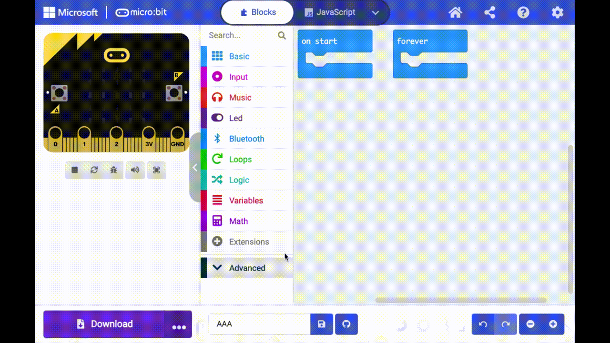
まずはmicro:bitから光センサの値をシリアルUARTで送信するコードを用意します。

プログラムのURL：[https://makecode.microbit.org/_c7AV2KYY6YH9](https://makecode.microbit.org/_c7AV2KYY6YH9)


この様にアホほど簡単です。
- [[light level]](https://makecode.microbit.org/reference/input/light-level)で光センサの値を取得し、
- [[serial write line]](https://makecode.microbit.org/reference/serial/write-line)でUART経由で送信します。

### プログラム書き込みとペアリング

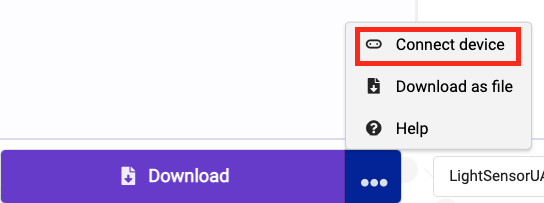

プログラムが作成できたら、Downloadボタン横のConnect deviceをクリックしてmakecodeWebエディタとmicro:bitをペアリングします。成功するとDownloadボタンからプログラムをWebUSB経由で直接micro:bitにダウンロードできるようになります。

もしペアリングに失敗する場合、micro:bitのファームウェアが古い場合があるので
こちらの[micro:bitファームウェアをアップデートする方法](https://microbit.org/guide/firmware/)に従ってアップデートしてください。


micro:bitのコードをロードしたらShowData(Device)ボタンをクリックして、コンソールとグラフ表示でセンサーが正常に動作していることを確認します。

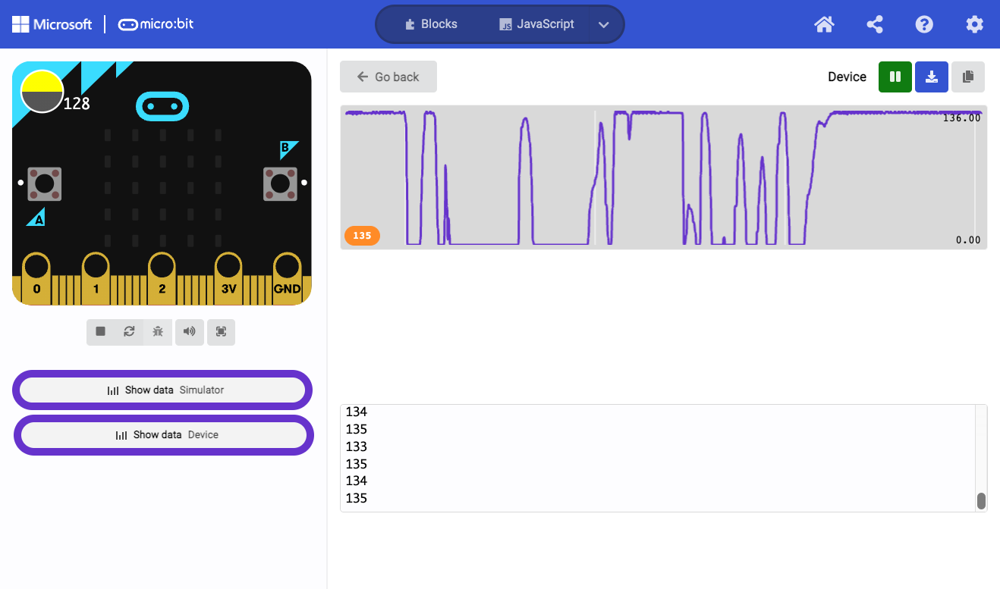

コンソールで十分動作を確認したら、アドレスバー左横の🔒アイコンをクリックしてmicro:bitのペアリングを解除します。これをしないと後にp5.js側とシリアルのバッファを奪い合う形になり通信速度が低下してラグが生じます。

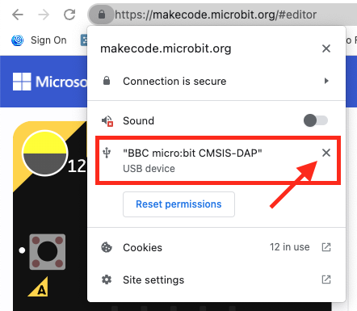

## p5.js [WebUSBライブラリ](https://nkymut.github.io/microbit-webusb-p5js/)のロード

次に、p5.js側のindex.htmlファイルに以下の行を追加して[ubitwebusb.js](https://nkymut.github.io/microbit-webusb-p5js/ubitwebusb.js)を読み込むようにします。


```html
  <script language="javascript" type="text/javascript" src="https://nkymut.github.io/microbit-webusb-p5js/ubitwebusb.js"></script>
```

### WebUSBライブラリ のセットアップ
ライブラリを設定したら、p5グローバル変数で宣言したmicro:bitにuBitWebUSBオブジェクトのインスタンスを作成します。

```js
  let microBit; //グローバル変数

  microBit = new uBitWebUSB(); //microBit WebUSBインスタンスの作成
```

次にmicro:bitへの接続・切断用のボタンを作成します。
Chromeのセキュリティ設定上の理由からユーザーの入力なしに外部デバイスと接続できないようになっているのでボタン押下イベントコールバックとして設定します。

```js
/* setup() 内*/
//add connect button
connectBtn = createButton("connect");
connectBtn.mousePressed(connect);
//add disconnect button
disconnectBtn = createButton("disconnect");
disconnectBtn.mousePressed(disconnect);
```

```js
/* sketch内のどこか */
//connect to microBit
function connect() {
  microBit.connectDevice();
}

//disconnect from microBit
function disconnect() {
  microBit.disconnectDevice();
}

```

p5.js とmicro:bitのやりとりはコールバック関数として設定します。

- `microBit.onConnect()`と`microBit.onDisonnect()`では接続・切断時のふるまいを指定して、
- `microBit.setReceiveUARTCallback()`ではmicro:bitからのデータを受信したときにどうするかを設定します。

ここでは受信した光センサのデータを電球の明るさ値に設定しています。

```js
  /* setup() 内*/
  microBit.onConnect(function(){　// 接続成功コールバック
    console.log("connected");
  });

  microBit.onDisconnect(function(){ //切断時コールバック
    console.log("disconnected");
  });


  microBit.setReceiveUARTCallback( // UART受信コールバック
    function(receivedData){　
      let val = int(receivedData); //受信テキストを数値に変換
      bulb.brightness = val; //電球の明るさ変更
    
      fadeSlider.value(bulb.brightness); //フェーダーに明るさを表示
    }
  );

```

## 動作チェック

というわけで実際に動作を試してみましょう。

<div class="p5div">
<iframe scrolling="no" class="p5livesample" allow="usb" src="https://nkymut.github.io/microbit-webusb-p5js/examples/uart_lightsensor/"> </iframe>
</div>

Connectボタンを押すと、下のようなポップアップ表示が出るので、お目当てのmicro:bitを選択して接続します。

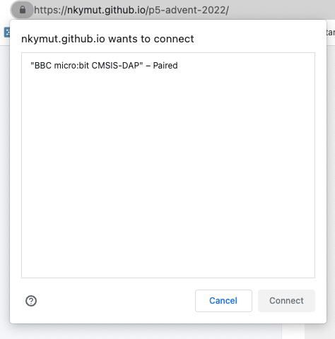

micro:bitとの接続が完了すると、光センサの値によって電球の明るさが変わるはずです。
スマホのライトを当てたりして遊んでみてください。
<br>もし、反応がひどく鈍い場合、
- micro:bitのエディタがmicro:bitに接続しっぱなしになっていないか？
- 複数のタブでWebUSBを使うp5スケッチが開かれて両方ともmicro:bitに接続されていないか?
- console.log()やprint()でUART受信したデータのログを大量に吐いてないか？

を確認してください。

以下、コードの全体です。

[https://github.com/nkymut/microbit-webusb-p5js/blob/master/examples/uart_lightsensor/sketch.js](https://github.com/nkymut/microbit-webusb-p5js/blob/master/examples/uart_lightsensor/sketch.js)

---

# WebBluetoothサンプル：光センサ

WebUSBが動いたところで早速、同じコードをWebBluetoothで無線化してみましょう。


[WebBluetoothライブラリダウンロード](https://github.com/nkymut/microbit-webble-p5js/zipball/master)

[https://github.com/nkymut/microbit-webble-p5js/tree/master/examples/uart_lightsensor](https://github.com/nkymut/microbit-webble-p5js/tree/master/examples/uart_lightsensor)


## micro:bitのBluetooth拡張

まず、micro:bitのmakeCodeエディタに[Bluetooth拡張](https://makecode.microbit.org/reference/bluetooth)を追加します。
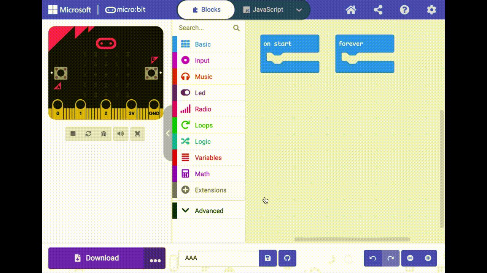


## micro:bitのBluetooth UART送信プログラム
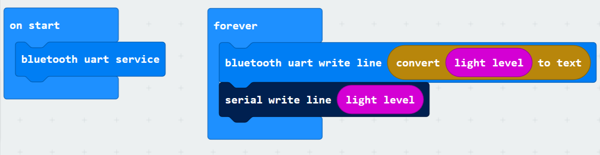

[https://makecode.microbit.org/_WhKc1b3w82kx](https://makecode.microbit.org/_WhKc1b3w82kx)

### Bluetooth UARTサービスの開始と送信
WebUSBサンプルで使用したコードに2点追加します。

 - [[bluetooth uart service]](https://makecode.microbit.org/reference/bluetooth/start-uart-service): Bluetooth UART サービスを開始する。 
 - [[bluetooth uart write line](https://makecode.microbit.org/reference/bluetooth/uart-write-line)] micro:bitから改行付きテキストデータを送信します。
 - [(convert to text)](https://makecode.microbit.org/reference/text/convert-to-text): [bluetooth uart write line]  は、数値データを直接指定することができないので数値をテキストに変換する必要があります。 

WebBluetooth光センサ micro:bitコード v01用: [microbit-LightSensorBLEUARTv01.hex](https://nkymut.github.io/microbit-webble-p5js/examples/uart_lightsensor/microbit_code/microbit-LightSensorBLEUARTv01.hex)


### Bluetooth 接続状態の表示
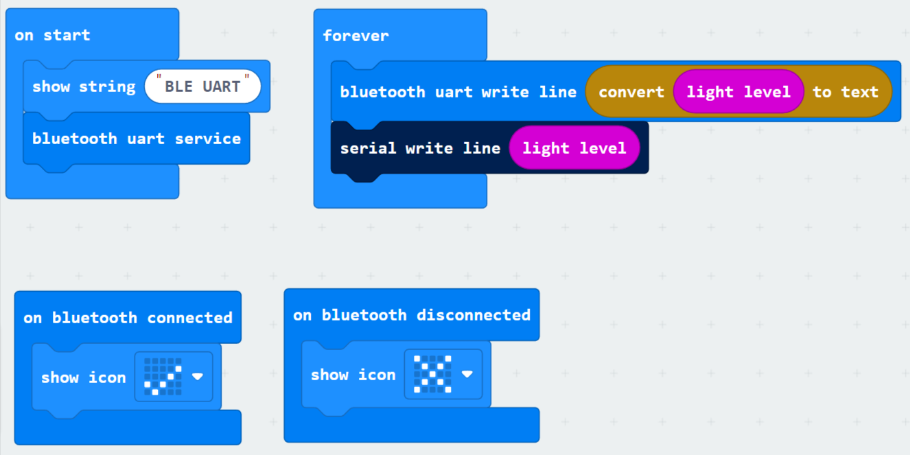

WebBluetooth光センサ micro:bitコード v02用:[microbit-LightSensorBLEUARTv02.hex](https://nkymut.github.io/microbit-webble-p5js/examples/uart_lightsensor/microbit_code/microbit-LightSensorBLEUARTv02.hex)

WebUSBと違い無線の場合、コンソールからmicro:bitの状態を確認できないので、
LEDマトリクスにBluetoothの接続状態を表示すると便利です。
しかし、LEDマトリクスの表示はメモリを大量に消費するらしく非力なv01(スピーカーやマイク入力のついていないタイプ)のmicro:bitだと[Error 20](https://support.microbit.org/support/solutions/articles/19000097280-020#:~:text=020%20Print&text=There%20is%20no%20free%20memory,a%20lot%20of%20large%20variables.&text=Try%20reducing%20your%20code%20by%20making%20functions%20out%20of%20large%20sections.)を表示して止まってしまう場合があります。

ここでは、

- [[on bluetooth connected]](https://makecode.microbit.org/reference/bluetooth/on-bluetooth-connected): Bluetooth 接続時に呼ばれるイベントハンドラ
- [on bluetooth disconnected](https://makecode.microbit.org/reference/bluetooth/on-bluetooth-disconnected): Bluetooth 切断時に呼ばれるイベントハンドラ

にそれぞれLED表示を設定します。

### micro:bit のペアリングモード設定
そして最後に一番大事なプロセス、makeCodeエディタ右上の⚙️のProject Settingsを選択して、
`No Parining Required`オプションを選択してください。
これを選択しないと、p5スケッチのConnectボタンを押してもmicro:bitが一覧に出てこず大いに時間を無駄にします。

|||
|:-:|:-|
|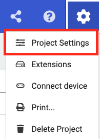|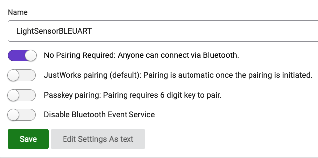|


https://makecode.microbit.org/_F8DFrygkTRP1

## p5.js WebBluetoothライブラリのロード

次に、p5.js側のindex.htmlファイルに以下の行を変更して[ubitwebble.js](https://nkymut.github.io/microbit-webble-p5js/ubitwebble.js)ライブラリを追加します。


```html
  <!-- WebUSBライブラリ -->
  <!-- <script language="javascript" type="text/javascript" src="https://nkymut.github.io/microbit-webusb-p5js/ubitwebusb.js"></script> -->

  <!-- WebBluetooth ライブラリ -->
  <script language="javascript" type="text/javascript" src="https://nkymut.github.io/microbit-webusb-p5js/ubitwebble.js"></script>
```

## WebBluetoothライブラリ のセットアップ
ライブラリを設定したら、以下の様にsetup()関数内でmicroBitのコンストラクタを`uBitWebUSB()`から`uBitWebBluetooth()`に変更してWebBluetoothオブジェクトのインスタンスを作成します。

```js
  let microBit; //グローバル変数

  microBit = new uBitWebBluetooth(); //microBit WebBluetoothインスタンスの作成
```

## 動作テスト

では実際に動作テストをしてみましょう！
<br>えっ、他にコードを追加しなくてよいんですかって？
そうなんです、`uBitWebUSB`と`uBitWebBluetooth`
では同じAPIでUART通信できるようにしてあるので、コンストラクタの変更だけで動きます。
[あっと驚くタメゴロー](https://www.youtube.com/watch?v=uNRT5oiIstQ)です。


<div class="p5div">
<iframe scrolling="no" class="p5livesample" allow="usb" src="https://nkymut.github.io/microbit-webble-p5js/examples/uart_lightsensor/"> </iframe>
</div>

## micro:bit のBluetoothペアリング
Connectボタンを押すと、WebUSBの時と同様に、ペアリングの画面が表示されます。
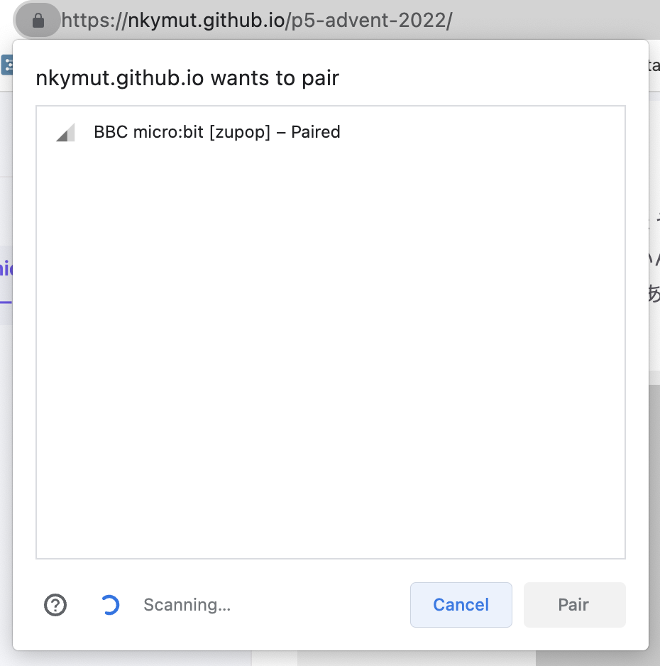{: width="50%" }

```
BBC micro:bit [固有ID]
```
ここで表示される5文字のアルファベットがmicro:bitのBluetooth通信時の固有IDになっており、
複数台のmicro:bitを扱う場合は、このIDで個体を認識します。

~~が！~~

~~このIDがなんと **実際接続してみる以外に知る方法がない！** のでワークショップなどで
数十台のmicro:bitを扱うときに事前にIDを調べておかないとハマります(ハマりました)。~~

追記：micro:bitの固有ID (device name)を知る方法ありました。
[https://support.microbit.org/support/solutions/articles/19000067679-how-to-find-the-name-of-your-micro-bit](https://support.microbit.org/support/solutions/articles/19000067679-how-to-find-the-name-of-your-micro-bit)

Advanced -> Control -> more から (device name) で取得できます。

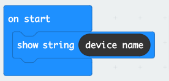

[show string]や[serial write line]で表示されたのち
micro:bit本体にシールなどでメモっておくと便利です。


# WebBluetoothサンプル：加速度センサ
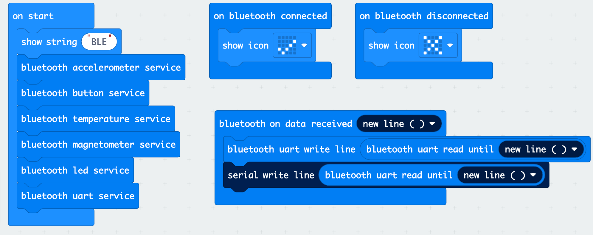

micro:bitのBluetooth拡張には、UARTの他にもmicro:bitの内部センサ値やボタンやLED・GPIOなどの入出力に直接アクセスするサービスが公開されています。
こちらがmicro:bitのBluetooth サービス全部入りコードです。
[https://makecode.microbit.org/61779-39134-92711-11083](https://makecode.microbit.org/61779-39134-92711-11083)

ここでは加速度センサを使った例を見てみます。

[https://github.com/nkymut/microbit-webble-p5js/tree/master/examples/accelerometer_3Dbox](https://github.com/nkymut/microbit-webble-p5js/tree/master/examples/accelerometer_3Dbox)


<div class="p5div">
<iframe scrolling="no" class="p5livesample" allow="usb" src="https://nkymut.github.io/microbit-webble-p5js/examples/accelerometer_3Dbox/
"> </iframe>
</div>

受信時のコールバック関数を指定する必要があったUARTと違い直接加速度センサのオブジェクトを取得して、
XYZのプロパティ値にアクセスできます。

```js
acceleration=microBit.getAccelerometer(); // 加速度センサオブジェクトの取得
acc_x=acceleration.x;　// X軸
acc_y=acceleration.y;　// Y軸 
acc_z=acceleration.z;  // Z軸
 ```

上の例ではX軸とY軸の値を箱のZとX軸の回転に割り当てています。

```js
function draw() {
  background(78);
  if (microBit.connected){

    noStroke();
    push();
    print("X:"+microBit.getAccelerometer().x);
    print("Y:"+microBit.getAccelerometer().y);
    print("Z:"+microBit.getAccelerometer().z);
　　 
    //箱の各軸を回転させる。
    rotateZ(map(microBit.getAccelerometer().x,-980,980,Math.PI/2,-Math.PI/2));
    rotateX(map(microBit.getAccelerometer().y,-980,980,-Math.PI/2,Math.PI/2));
    box(150);
    pop();

  }

}
```

この加速度センサ入力を[p5.play](https://p5play.org/)と組み合わせると
[このようなゲーム](https://nkymut.github.io/microbit-webble-p5js/examples/p5play_example/)を作ることができます。


<div class="p5div">
<iframe scrolling="no" class="p5livesample" allow="usb" style="width:800px" src="https://nkymut.github.io/microbit-webble-p5js/examples/p5play_example/
"> </iframe>
</div>

---
# まとめ

以上、p5.jsとmico:bitをWebUSBとWebBluetooth経由で通信させて簡単な物理入力デバイスを作る方法を紹介しました。

今回紹介しきれなかった、Neopixel LEDのコントロールなど様々なサンプルを今後もアップデートしていくので、
下の各ライブラリGitHubプロジェクトのフォローをお願いします。

もし、改善要望やバグなどありましたらどうぞお気軽にIssueやプルリクを送ってください。
特に、現状WebBluetoothライブラリでは　IO操作が実装されていなかったり、LEDマトリックス操作に
致命的なバグがあるので協力して頂ける人を募集中です。

||||
|--|--|--|
|WebUSB| [https://github.com/nkymut/microbit-webusb-p5js](https://github.com/nkymut/microbit-webusb-p5js)|
|WebBluetooth|[https://github.com/nkymut/microbit-webble-p5js](https://github.com/nkymut/microbit-webble-p5js)|


p5.jsでハードウェア入力を扱う方法としては他にWebMidiという方法があります。
以前p5.soundをMIDI経由で鳴らすチュートリアルを行った際のドキュメントがここにありますので興味がある方はぜひ。
[https://github.com/nkymut/ShapeOfSound/blob/main/tutorials/wk06/p5sound_tutorial.md#06-p5sound--midi-input](https://github.com/nkymut/ShapeOfSound/blob/main/tutorials/wk06/p5sound_tutorial.md#06-p5sound--midi-input)


それでは良い師走を〜🎅


# 参考

- micro:bit Bluetooth Profile <br>
[https://lancaster-university.github.io/microbit-docs/resources/bluetooth/bluetooth_profile.html](https://lancaster-university.github.io/microbit-docs/resources/bluetooth/bluetooth_profile.html)


# [おまけ] p5.js 環境でのハードウェア通信ライブラリ

p5.jsとハードウェアの通信用ライブラリは、WebUSBやWebBluetooth以外に様々あるのですが、
ググってもWeb上にいまいち情報がまとまってないのでここにまとめます。
もしここに載っていない便利なライブラリがあればプルリクなどで教えて下さい。

|プロトコル|  ライブラリ | 状況  |ライセンス|
|:---:|:---:|---|:---:|
|Serial|[p5-serial](https://p5-serial.github.io/)|ブラウザ非依存だが、ホストPC側に別途ミドルウェアをインストールする必要があり、イマイチ不便|MIT|
|WebUSB|  [microbit-webusb](https://github.com/bsiever/microbit-webusb) |  WebUSB 安定してるがクラス化されてない  |MIT|
|WebBluetooth| [microBit.js by antefact ](https://antefact.github.io/microBit.js/) | WebBluetooth 一通り動くがI/O PinとUARTサポートしてない |LGPL-2.1|
|WebBluetooth|[IAMAS小林茂さんのGist](https://gist.github.com/kotobuki/7c67f8b9361e08930da1a5cfcfb0653f)|WebBluetooth UART p5.js サンプルコード|N/A|
|WebBluetooth| [p5.ble.js](https://itpnyu.github.io/p5ble-website/)  | p5.js汎用WebBluetoothライブラリ、<br>UUIDを直接指定する必要あり、初学者にはハードル高い  | MIT|
|WebBluetooth| [p5.toio](https://github.com/tetunori/p5.toio)|toio™をWebBlueetoh経由でp5から操作する|MIT|
|WebMIDI|[webmidi.js](https://github.com/djipco/webmidi) |[p5.soundをMIDIデバイスで鳴らしたりできる。](https://github.com/nkymut/ShapeOfSound/blob/main/tutorials/wk06/p5sound_tutorial.md#06-p5sound--midi-input)|Apache2.0|
|WebSerial| [p5.webserial](https://github.com/gohai/p5.webserial/)|試してないがBautRateとか指定できて便利そう|N/A|
|WebSerial|[p5.web-serial](https://github.com/ongzzzzzz/p5.web-serial) |上に同じ|MIT|

