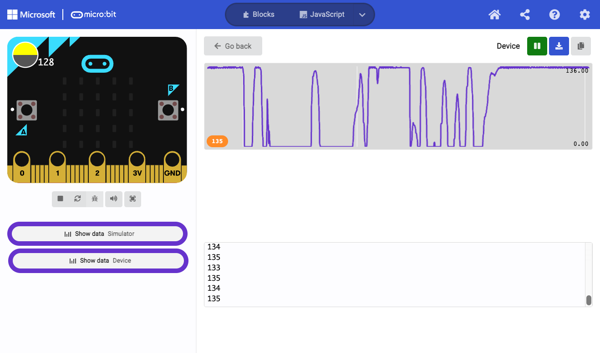
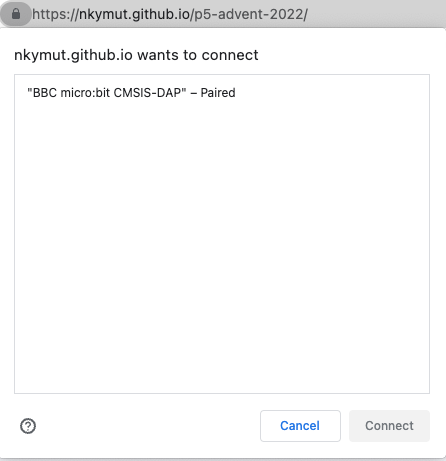

<!-- Google tag (gtag.js) -->
<script async src="https://www.googletagmanager.com/gtag/js?id=G-GX0HTR3LCT"></script>
<script>
  window.dataLayer = window.dataLayer || [];
  function gtag(){dataLayer.push(arguments);}
  gtag('js', new Date());

  gtag('config', 'G-GX0HTR3LCT');
</script>


# p5.js とmicro:bit でフィジカルコンピューティング

本記事は、[Processing Advent Calendar 2022](https://adventar.org/calendars/7370)の9日目の記事です。

## はじめに

この記事では、p5.jsとmicro:bitを使ってプログラミング初学者でも簡単に物理的な入出力デバイスを作成する方法について解説します。
具体的には、p5.jsからWebUSBやWebBluetoothを使ってmicro:bitのボタンやセンサ入力のやり取りする方法を紹介します。

筆者が受け持っているシンガポール国立大学のインダストリアルデザイン学科での授業では、
このp5.jsとmicro:bitをつかって、プログラム経験ゼロから7週で下のような作品を作れるようにしています。

<iframe src="https://www.youtube.com/embed/rqI1p5iXJeo" title="YouTube video player" frameborder="0" allow="accelerometer; autoplay; clipboard-write; encrypted-media; gyroscope; picture-in-picture" allowfullscreen></iframe>

というわけで、ここでは、この授業で使っている以下の2つのライブラリをご紹介いたします。

||||
|--|--|--|
|WebUSB| https://github.com/nkymut/microbit-webusb-p5js|[microbit-webusb](https://github.com/bsiever/microbit-webusb) をクラス化、<br>複数インスタンス接続可にしたもの|
|WebBluetooth|https://github.com/nkymut/microbit-webble-p5js|[microBit.js by antefact ](https://antefact.github.io/microBit.js/)に[IAMAS小林茂さんのGist](https://gist.github.com/kotobuki/7c67f8b9361e08930da1a5cfcfb0653f)のコードをマージしてUART対応したもの|


## 環境と制限

p5.jsとmicro:bit間の通信にはWebブラウザから、有線のWebUSBと無線のWebBluetoothが使えます。

ProcessingやArduinoではソフトとハードのやり取りにシリアル通信を用いますが、
50人を超えるプログラミング初学者向けクラスでは、
ドライバから通信ポートのセットアップやトラブルシュートで授業時間がまるまる潰れてしまいます。

その点、p5.jsとmicro:bitだと追加ドライバやアプリのインストールが要らずWebブラウザだけで完結できるので楽勝です。

また、micro:bitには標準で加速度、光、磁気センサなどの基本的なセンサやボタン入力が装備されているため、自作ハードウェア特有のセンサ値の不安定さに悩まされることなく、即センサ入力を利用したインタラクション設計を始めることができます。


### 各WebブラウザのWebUSB/WebBluetooth対応状況

しかしながら2022年12月現在、WebUSBとWebBluetoothをサポートしているブラウザはChrome(とOpera)のみになっています。
特にSafariではセキュリティ上の理由で実装しないことが[明言されている](https://www.zdnet.com/article/apple-declined-to-implement-16-web-apis-in-safari-due-to-privacy-concerns/)ので今後のサポートも期待できないでしょう。

2022年12月現在現在の各Webブラウザでのサポート状況は以下の様になっています。

|  環境 | [WebUSB](https://caniuse.com/webusb)  |　[WebBluetooth](https://caniuse.com/web-bluetooth)|
|---|:---:|:---:|
| Chrome (Win/Mac) / Edge  |○|○|
| Safari |×|×|
| Firefox |×|×|
| Oper |○|○|
| Chrome on Android |○|○|
| Safari on iOS|×|×|
| Chromium on Raspberry PI |_|_|


### p5.js 環境の対応状況

またp5js.org謹製エディタユーザーには悲しいお知らせなのですが、[editor.p5js.org](https://editor.p5js.org/ ) 
では現状[WebBluetoothが機能していない](https://github.com/processing/p5.js-web-editor/issues/1900)ようです。


|  環境 | WebUSB  |　WebBluetooth|
|---|:---:|:---:|
| [https://editor.p5js.org/](https://editor.p5js.org/ )  |○|×|
| [https://openprocessing.org/](https://openprocessing.org/) |○|○|
|  [https://glitch.com/](https://glitch.com/) |○|○|
|  [VSCode LiveServer](https://marketplace.visualstudio.com/items?itemName=ritwickdey.LiveServer) |○|○|


### p5.js 環境でのWeb USB, WebBluetoothライブラリ

p5.js上でのWebUSBやWebBluetoothの各種ライブラリやサンプルについては、
ググってもWeb上にいまいち情報がまとまってないのでここにまとめます。

|プロトコル|  ライブラリ | 状況  |ライセンス|
|:---:|:---:|---|:---:|
|WebUSB|  [microbit-webusb](https://github.com/bsiever/microbit-webusb) |  WebUSB 安定してるがクラス化されてない  |MIT|
|WebBluetooth| [microBit.js by antefact ](https://antefact.github.io/microBit.js/) | WebBluetooth 一通り動くがI/O PinとUARTサポートしてない |LGPL-2.1|
|WebBluetooth|[IAMAS小林茂さんのGist](https://gist.github.com/kotobuki/7c67f8b9361e08930da1a5cfcfb0653f)|WebBluetooth UART p5.js サンプルコード|?|
|WebBluetooth| [p5.ble.js](https://itpnyu.github.io/p5ble-website/)  | p5.js汎用WebBluetoothライブラリ、<br>UUIDを直接指定する必要あり、初学者にはハードル高い  | MIT|
|WebBluetooth| [p5.toio](https://github.com/tetunori/p5.toio)|toio™をWebBlueetoh経由でp5から操作する|MIT|

また、[p5js.org](https://p5js.org/libraries/)のライブラリ一覧にある[p5-serial](https://p5-serial.github.io/)を使うとシリアル通信を利用可能ですが、ホストPC側に別途ミドルウェアをインストールする必要があり、イマイチ不便なところがあります。


と、まとめたものの、それぞれ長所短所があるので、それぞれ改善版をこちらに置いておきました。以下のチュートリアルはこれらを使用します。

||||
|--|--|--|
|WebUSB| https://github.com/nkymut/microbit-webusb-p5js|[microbit-webusb](https://github.com/bsiever/microbit-webusb) をクラス化、複数インスタンス接続可|
|WebBluetooth|https://github.com/nkymut/microbit-webble-p5js|[microBit.js by antefact ](https://antefact.github.io/microBit.js/)に[IAMAS小林茂さんのGist](https://gist.github.com/kotobuki/7c67f8b9361e08930da1a5cfcfb0653f)のコードをマージしてUART対応|


# WebUSBチュートリアル

ここではmicro:bitの光センサで電球の色を変えてみましょう。

https://nkymut.github.io/microbit-webusb-p5js/examples/RecvLightSensor/
<iframe allow="usb" src="https://nkymut.github.io/microbit-webusb-p5js/examples/RecvLightSensor/"> </iframe>


## micro:bitプログラム

まずはmicro:bitから光センサの値をシリアルUARTで送信するコードを用意します。
下の用にアホほど簡単です。


プログラムのURL
https://makecode.microbit.org/_c7AV2KYY6YH9

micro:bitのコードをロードしたらShowDataからコンソールのグラフ表示でセンサーが正常に動作していることを確認します。micro:bitのプログラムもWebUSB経由で書き込み可能なので
ペアリングをしてしまえば書き込みボタン押し込みで自動的にアップデートされます。


{: width="50%" }

コンソールで十分動作を確認したら、ブラウザのタブを閉じるか、アドレスバー左横の🔒アイコンをクリックしてmicro:bitのペアリングを解除します。これをしないと後にp5.js側とシリアルのバッファを奪い合う形になり通信速度が低下してラグが生じます。


## [ubitwebusb.js](https://nkymut.github.io/microbit-webusb-p5js/ubitwebusb.js)ライブラリのロード

次に、p5.js側のindex.htmlファイルに以下のラインを追加して[ubitwebusb.js](https://nkymut.github.io/microbit-webusb-p5js/ubitwebusb.js)ライブラリを追加します。


```html
  <script language="javascript" type="text/javascript" src="https://nkymut.github.io/microbit-webusb-p5js/ubitwebusb.js"></script>
```

## WebUSBライブラリ のセットアップ
ライブラリを設定したら、以下の用にsetup()関数内でWebUSBのインスタンスを作成し

```js
//グローバル変数

let microBit;

// Buttons to connect/disconnect to micro:bit
let connectBtn;
let disconnectBtn;


```


```js

  microBit = new uBitWebUSB(); //microBit WebUSBインスタンスの作成

  microBit.onConnect(function(){　// 接続成功コールバック
    console.log("connected");
  });

  microBit.onDisconnect(function(){ //切断コールバック
    console.log("disconnected");
  });


  microBit.setReceiveUARTCallback( // UART受信コールバック
    function(receivedData){　
      let val = int(receivedData);
      bulb.brightness = val;
    
      fadeSlider.value(bulb.brightness);
    }
  );

```
次に接続・切断用のボタンを作成します。`microBit.uBitConnectDevice();`で接続、`microBit.uBitDisconnect();`で切断です。Chromeのセキュリティ上の理由からユーザーの入力なしに外部デバイスと接続できないようになっているのでボタン押下イベントコールバックとして設定します。

```js
  //setup() 内
  //add connect button
  connectBtn = createButton("connect");
  connectBtn.mousePressed(connect);
  //add disconnect button
  disconnectBtn = createButton("disconnect");
  disconnectBtn.mousePressed(disconnect);
```

```js
  // sketch内のどこか
//connect to microBit
function connect() {
  microBit.uBitConnectDevice();
}

//disconnect from microBit
function disconnect() {
  microBit.uBitDisconnect();
}

```

##
というわけで試してみましょう、Connectボタンを押すと、下のようなポップアップ表示が出るので、お目当てのmicro:bitを選択して接続します。



接続すると、光センサの値によって電球の明るさが変わるはずです。
もし、反応がひどく鈍い場合、micro:bitのエディタが接続しっぱなしになっていないか？
複数のタブで同じスケッチが開かれて両方とも接続されていないかを確認してください。

<iframe allow="usb" src="https://nkymut.github.io/microbit-webusb-p5js/examples/RecvLightSensor/"> </iframe>

以下、コードの全体です。

```js
/*
 * @name WebUSB Control bulb object with lightsensor value
 * @description This example receives lightsensor value from micro:bit over WebUSB. 
 *  Using microbit-webusb library. https://github.com/bsiever/microbit-webusb
 
 Setup: 
 1. Upgrade Micro:bit to latest firmware (above version 249) 
** [Updating your micro:bit firmware](https://microbit.org/guide/firmware/)

2. Program the Micro:bit with one of the example programs that generates serial data
[micro:bit code](https://makecode.microbit.org/_c5iHFsERyPhr)

 */

//The Bulb object
let bulb = {
  brightness: 0,
  bulbOn: "",
  bulbOff: "",
  on: function() {
    this.brightness = 255;
  },
  off: function() {
    this.brightness = 0
  },
  draw: function(xPos, yPos, width, height) {
    if (this.brightness > 0) {
      //show bulbOn image
      tint(this.brightness);
      image(this.bulbOn, xPos, yPos, width, height);
    } else {
      //shoe bulbOff image
      tint(255);
      image(this.bulbOff, xPos, yPos, width, height);
    }
  }
}

// Buttons to connect/disconnect to micro:bit
let connectBtn;
let disconnectBtn;

let microBit;

function setup() {
  createCanvas(400, 400);
  

  microBit = new uBitWebUSB();

  microBit.onConnect(function(){
    console.log("connected");
  });

  microBit.onDisconnect(function(){
    console.log("disconnected");
  });

  microBit.setReceiveUARTCallback(function(receivedData){
    let val = int(receivedData);
    bulb.brightness = val;
    
    fadeSlider.value(bulb.brightness);
  });

  // microBit.setReceiveUARTCallback(handleData);

  //add connect button
  connectBtn = createButton("connect");
  connectBtn.mousePressed(connect);
  //add disconnect button
  disconnectBtn = createButton("disconnect");
  disconnectBtn.mousePressed(disconnect);
  

  //add bulbOn/bulbOff images as properties
  bulb.bulbOn = loadImage("images/bulb_on.png");
  bulb.bulbOff = loadImage("images/bulb_off.png");

  //set default brightness  
  bulb.brightness = 0;
  
  //create a slider
  fadeSlider = createSlider(0,255,0,1); //createSlider(MIN,MAX,default,step)
  fadeSlider.style("width","300px");
  fadeSlider.class("slider") // set a CSS class to change appearence.
  fadeSlider.position(50,height - 40);
  fadeSlider.input(fade); // assign fade() function for the callback


}

function draw() {
  background(200);
  fill(0);

  //Check whether brightness is 0:off or 1:on.
  bulb.draw(50, 50, 300, 300);

}

//When a mouse button is pressed
function mousePressed() {
  //switch on the bulb
  bulb.on();
}

//When a mouse button is released
function mouseReleased() {
  //switch off the bulb
  bulb.off();

}

//Fade brightness with the slider value
function fade(){
  brightness = fadeSlider.value();
}

//connect to microBit
function connect() {
  microBit.uBitConnectDevice();
}

//disconnect from microBit

function disconnect() {
  microBit.uBitDisconnect();
}


```
---


# WebBluetoothチュートリアル
## WebUSBライブラリ のセットアップ


---
## まとめ

WebUSBとWebBluetoothの使い方を紹介しました。

p5.jsでハードウェア入力を扱う方法としては他に
WebMidiという方法がありますが以前p5.soundを絡めたチュートリアルがここにありますので興味がある方はぜひ。
https://github.com/nkymut/ShapeOfSound/blob/main/tutorials/wk06/p5sound_tutorial.md#06-p5sound--midi-input


## 参考

[P5.ble:https://itpnyu.github.io/p5ble-website/](https://itpnyu.github.io/p5ble-website/)

- micro:bit Bluetooth Profile <br>
https://lancaster-university.github.io/microbit-docs/resources/bluetooth/bluetooth_profile.html