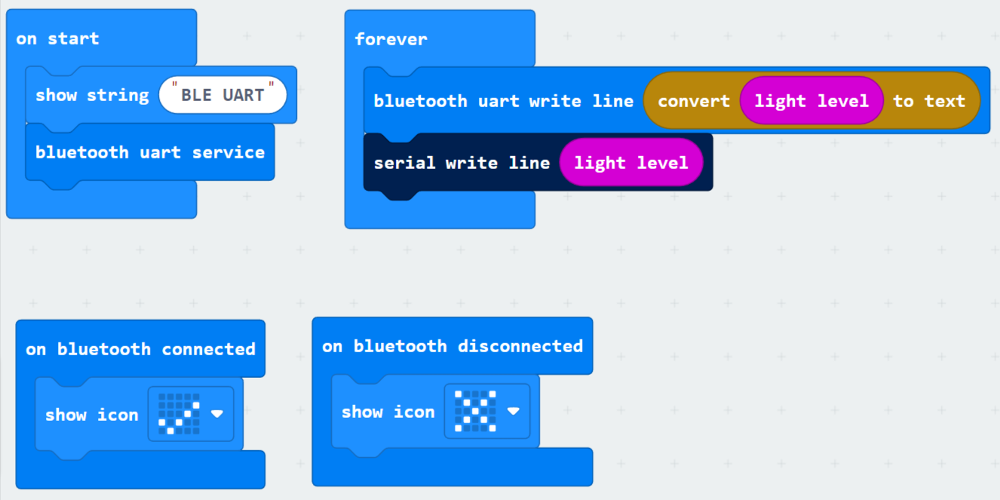
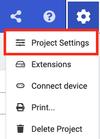
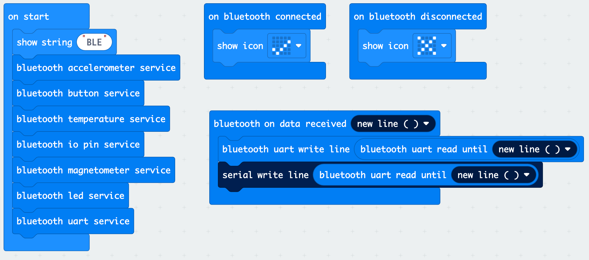

<style>
.p5div{
  padding:10px;
  background:#F0F0F0;
  display: flex;
  align-items: center;
  justify-content: center;
}  
.p5livesample{
  height: 430px;
  width: 410px;
  padding: 0px;
  margin: 0px;
  top: 0%;
  left: 0;
  overflow: hidden;
  border: none;
}
</style>
# Physical computing with p5.js and micro:bit

This article is the 9th day of [Processing Advent Calendar 2022](https://adventar.org/calendars/7370).


<details close markdown="block">
  <summary>
    Table of Contents
  </summary>
  {: .text-delta }
1. TOC
{:toc}
</details>

## Introduction

This article explains how to use [p5.js](https://p5js.org/) and [micro:bit](https://microbit.org/) to create physical input/output devices easily.
Specifically, we will show how to communicate with micro:bit sensor inputs from p5.js via WebUSB and WebBluetooth.

[The author](https://github.com/nkymut) teaches at the Division of Industrial Design at the National University of Singapore. And using p5.js and micro:bit, Students can create works like the video below in 7 weeks from almost zero programming experience.

<iframe scrolling="no" width="100%" height="300pem" src="https://www.youtube.com/embed/rqI1p5iXJeo" title="YouTube video player" frameborder="0" allow="accelerometer; autoplay; clipboard-write; encrypted-media; gyroscope; picture-in-picture" allowfullscreen> </iframe>


　<br>
[Developed by the BBC to be distributed to all elementary school students in the UK](https://ja.wikipedia.org/wiki/BBC_Micro:bit#:~:text=1980%E5%B9%B4%E4%BB% A3%E3%81%AB%E6%83%85%E5%A0%B1%E6%95%99%E8%82%B2,%E7%89%88%E3%81%8C%E7%99%BA %E5%A3%B2%E3%81%95%E3%82%8C%E3%81%9F%E3%80%82) micro:bit has the impression that it is only for elementary STEM education. However, equipped with basic sensors such as accelerometer, temperature, light, magnetic sensors and button inputs as standard features,You can immediately start advanced interaction design using sensor input without being bothered by the instability of sensor values ​​peculiar to self-made hardware.

Processing and Arduino, which are common in physical computing teaching materials, mainly use serial communication to exchange software and hardware. However, in a programming beginner class of 50+ students, the class time (and my ❤️) is squandered from installing drivers for different platforms to troubleshooting communication ports.

On the other hand, for communication between p5.js and micro:bit, you can use wired WebUSB and wireless WebBluetooth from a web browser.
In this case, there is no need to install additional drivers or settings, and it is easy to complete with just a web browser.

So, here I will introduce the following two libraries to enable communication between p5.js and micro:bit via WebUSB and WebBluetooth

||||
|--|--|--|
|WebUSB| [https://nkymut.github.io/microbit-webusb-p5js/](https://nkymut.github.io/microbit-webusb-p5js/)|[microbit-webusb by bseiver](https://github.com/bsiever/microbit-webusb) wrapped in a class to allow multiple instances to be connected|
|WebBluetooth|[https://nkymut.github.io/microbit-webble-p5js/](https://nkymut.github.io/microbit-webble-p5js/)|Add the code of [IAMAS Shigeru Kobayashi's Gist](https://gist.github.com/kotobuki/7c67f8b9361e08930da1a5cfcfb0653f) to [microBit.js by antefact ](https://antefact.github.io/microBit.js/) and support UART|


## Environment and limits

First of all, there are some limitations when using p5.js and micro:bit over WebUSB/WebBluetooth.

### Web browser support status for WebUSB/WebBluetooth

As of December 2022, Chrome (and Opera) are the only browsers that support WebUSB and WebBluetooth.Especially in Safari, it is [clearly stated](https://www.zdnet.com/article/apple-declined-to-implement-16-web-apis-in-safari-due-to-privacy-concerns/) that they have declined to implement these features due to pricacy concerns. So don't expect any future support.

The support status of each web browser is as follows. (Ref. [caniuse.com](caniuse.com))

|  Environment | [WebUSB](https://caniuse.com/webusb)  |　[WebBluetooth](https://caniuse.com/web-bluetooth)|
|---|:---:|:---:|
| Chrome (Win/Mac) / Edge  |○|○|
| Safari |×|×|
| Firefox |×|×|
| Opera |○|○|
| Chrome on Android |○|○|
| Safari on iOS|×|×|
| Chromium on Raspberry PI |_|_|


### Support status of p5.js environment

Also, sad news for [editor.p5js.org](https://editor.p5js.org/) users,
Currently [WebBluetooth is not working](https://github.com/processing/p5.js-web-editor/issues/1900).
[openprocessing.org/](https://openprocessing.org/) or [local setup with LiveServer on VS Code](https://timrodenbroeker.de/how-to-use-p5-js-with-visual-studio-code/) are recommended for the time being.

| Environemt | WebUSB  |　WebBluetooth|
|---|:---:|:---:|
| [https://editor.p5js.org/](https://editor.p5js.org/ )  |○|×|
| [https://openprocessing.org/](https://openprocessing.org/) |○|○|
|  [https://glitch.com/](https://glitch.com/) |○|○|
|  [VSCode LiveServer](https://marketplace.visualstudio.com/items?itemName=ritwickdey.LiveServer) |○|○|

# WebUSB：Optical sensor input

Now let's change the color of the light bulb with the micro:bit's light sensor.

[WebUSB library download](https://github.com/nkymut/microbit-webusb-p5js/zipball/master)

[https://github.com/nkymut/microbit-webusb-p5js/tree/master/examples/uart_lightsensor](https://github.com/nkymut/microbit-webusb-p5js/tree/master/examples/uart_lightsensor)

<div class="p5div">
<iframe scrolling="no" class="p5livesample" allow="usb" src="https://nkymut.github.io/microbit-webusb-p5js/examples/uart_lightsensor/"> </iframe>
</div>


## Prepare micro:bit program

First, prepare a code to send the light sensor value from the micro:bit via serial UART.

Program URL: [https://makecode.microbit.org/_c7AV2KYY6YH9](https://makecode.microbit.org/_c7AV2KYY6YH9)


It's ridiculously easy like this.

-Get the light sensor value with [[light level]](https://makecode.microbit.org/reference/input/light-level),
-Send over UART with [[serial write line]](https://makecode.microbit.org/reference/serial/write-line).

### Pairing makeCode editor with micro:bit hardware


Once the program is created, click the Connect device next to the Download button to pair the makecode web editor with the micro:bit. If successful, the Download button will allow you to download the program directly to your micro:bit via WebUSB.

If pairing fails regardless of the connection, the micro:bit firmware may be outdated.
Please follow this article [how to update micro:bit firmware](https://microbit.org/guide/firmware/) to update the firmware.

After loading the micro:bit's code, click the ShowData(Device) button to see the sensor working properly in the console and graphical display.


After confirming the operation on the console, click the 🔒 icon on the left side of the address bar to unpair the micro:bit. Failure to do so will lead to the decrease and lag of the communication speed with micro:bit and p5.js. This may be due to multiple program threads competing for the same serial buffer.


## Load p5.js [WebUSB library](https://nkymut.github.io/microbit-webusb-p5js/)

Next, add the following line to the index.html file on the p5.js side to load [ubitwebusb.js](https://nkymut.github.io/microbit-webusb-p5js/ubitwebusb.js). 

```html
  <script language="javascript" type="text/javascript" src="https://nkymut.github.io/microbit-webusb-p5js/ubitwebusb.js"></script>
```

### WebUSB library setup
After setting up the library, instantiate a uBitWebUSB object on the micro:bit declared in the p5 global variable.

```js
  let microBit; //global variable

  microBit = new uBitWebUSB(); //create microBit WebUSB instance
```

Next, create buttons for connecting/disconnecting to the micro:bit.
Due to Chrome's security settings, it is not possible to connect to an external device without user input, so we set it as a button press event callback.

```js
/* Inside setup()*/
//add connect button
connectBtn = createButton("connect");
connectBtn.mousePressed(connect);
//add disconnect button
disconnectBtn = createButton("disconnect");
disconnectBtn.mousePressed(disconnect);
```

```js
/* somewhere in the sketch */
//connect to microBit
function connect() {
  microBit.connectDevice();
}

//disconnect from microBit
function disconnect() {
  microBit.disconnectDevice();
}

```

Communication between p5.js and micro:bit is set as a callback function.

-`microBit.onConnect()` and `microBit.onDisonnect()` specify behavior when connecting/disconnecting,
-`microBit.setReceiveUARTCallback()` sets what to do when data is received from the micro:bit.

The code below sets the light sensor data received vis UART to the brightness value of the bulb object.

```js
/*in setup() */
  microBit.onConnect(function(){ //Connection success callback
    console.log("connected");
  });

  microBit.onDisconnect(function(){ //Disconnection callback
    console.log("disconnected");
  });


  microBit.setReceiveUARTCallback( //UART receive callback
    function(receivedData) {　
      let val = int(receivedData); //convert the received text to a number
      bulb.brightness = val; //change bulb brightness
    
      fadeSlider.value(bulb.brightness); //display brightness on fader
    }
  );

```

## operation check

So let's try it in action.

<div class="p5div">
<iframe scrolling="no" class="p5livesample" allow="usb" src="https://nkymut.github.io/microbit-webusb-p5js/examples/uart_lightsensor/"> </iframe>
</div>

When you press the Connect button, a pop-up like the one below will appear, so select the micro:bit you want to connect to.


Once connected with the micro:bit, the brightness of the light bulb should change depending on the light sensor value.
Try playing with the torch light feature of your smartphone.
<br>If the response is terribly sluggish, please check the following
-Is your micro:bit editor stuck connected to your micro:bit?
-Do you have p5 sketches with WebUSB open in multiple tabs and both connected to the micro:bit?
-Isn't console.log() and print() outputting a large amount of data received by UART?


The entire code can be found below.

[https://github.com/nkymut/microbit-webusb-p5js/blob/master/examples/uart_lightsensor/sketch.js](https://github.com/nkymut/microbit-webusb-p5js/blob/master/examples/uart_lightsensor/sketch.js)

---

# WebBluetooth Sample: Light Sensor

Now that WebUSB works, let's make the same code wireless with WebBluetooth.


[Web Bluetooth library download](https://github.com/nkymut/microbit-webble-p5js/zipball/master)

[https://github.com/nkymut/microbit-webble-p5js/tree/master/examples/uart_lightsensor](https://github.com/nkymut/microbit-webble-p5js/tree/master/examples/uart_lightsensor)


## micro:bit Bluetooth extension

まず、micro:bitのmakeCodeエディタに[Bluetooth拡張](https://makecode.microbit.org/reference/bluetooth)を追加します。


## micro:bit Bluetooth UART transmission program


[https://makecode.microbit.org/_WhKc1b3w82kx](https://makecode.microbit.org/_WhKc1b3w82kx)

### Start and send Bluetooth UART service
Add following module to the code used in the WebUSB sample to enable Bluetooth UART service and send light sensor value via WebBluetooth.

 - [[bluetooth uart service]](https://makecode.microbit.org/reference/bluetooth/start-uart-service): Start the Bluetooth UART service.
 - [[bluetooth uart write line](https://makecode.microbit.org/reference/bluetooth/uart-write-line)] Send text data with line breaks from micro:bit.
 - [(convert to text)](https://makecode.microbit.org/reference/text/convert-to-text): [bluetooth uart write line]  cannot specify numeric data directly, it must convert numeric values ​​to text.

WebBluetooth light sensor for micro:bit code v01: [microbit-LightSensorBLEUARTv01.hex](https://nkymut.github.io/microbit-webble-p5js/examples/uart_lightsensor/microbit_code/microbit-LightSensorBLEUARTv01.hex)


### Display of Bluetooth connection status


WebBluetooth Light Sensor for micro:bit code v02: [microbit-LightSensorBLEUARTv02.hex](https://nkymut.github.io/microbit-webble-p5js/examples/uart_lightsensor/microbit_code/microbit-LightSensorBLEUARTv02.hex)

Unlike WebUSB, you cannot check the status of micro:bit from the console as it is wireless. So, it is convenient to display the Bluetooth connection status on the LED matrix. However, the display of the LED matrix seems to consume a large amount of memory, and with a powerless v01 micro:bit (type without speaker or microphone input) [Error 20](https://support.microbit.org/support/solutions/articles/19000097280-020#:~:text=020%20Print&text=There%20is%20no%20free%20memory,a%20lot%20of%20large%20variables.&text=Try%20reducing%20your%20code%20by%20making %20functions%20out%20of%20large%20sections.) and stops.

Here, we set the LED icon for each connection status by using following bluetooth connection event handlers.

-[[on bluetooth connected]](https://makecode.microbit.org/reference/bluetooth/on-bluetooth-connected): event handler called when bluetooth is connected
-[on bluetooth disconnected](https://makecode.microbit.org/reference/bluetooth/on-bluetooth-disconnected): event handler called when bluetooth is disconnected


### micro:bit pairing mode settings
And finally, the most important process, select ⚙️ Project Settings on the top right of the makeCode editor,
Select the `No Paring Required` option.
If you don't select this, pressing the Connect button on the p5 sketch won't show your micro:bit in the list, wasting a lot of your time.

|||
|:-:|:-|
|||


https://makecode.microbit.org/_F8DFrygkTRP1

## Loading the p5.js WebBluetooth Library

Next, add the [ubitwebble.js](https://nkymut.github.io/microbit-webble-p5js/ubitwebble.js) library by changing the following line in the index.html file on the p5.js side. increase.

```html
<!--WebUSB Library -->
  <!--<script language="javascript" type="text/javascript" src="https://nkymut.github.io/microbit-webusb-p5js/ubitwebusb.js"></script> -->

  <!--WebBluetooth library -->
  <script language="javascript" type="text/javascript" src="https://nkymut.github.io/microbit-webusb-p5js/ubitwebble.js"></script>
```

## WebBluetooth library setup
After setting up the library, create an instance of the WebBluetooth object by changing the constructor of microBit from `uBitWebUSB()` to `uBitWebBluetooth()` in the setup() function as follows.

```js
let microBit; //global variable

  microBit = new uBitWebBluetooth(); //create microBit WebBluetooth instance
```

## Operation test

Now let's test it in action!
<br>
What? You don't need to add any other code?
That's right, since the same API is used to enable UART communication on both `uBitWebUSB` and `uBitWebBluetooth`, all you need to do is change the constructor.
It's [Amazing Mr.Tamegoro!](https://www.youtube.com/watch?v=uNRT5oiIstQ)

<div class="p5div">
<iframe scrolling="no" class="p5livesample" allow="usb" src="https://nkymut.github.io/microbit-webble-p5js/examples/uart_lightsensor/"> </iframe>
</div>

## Bluetooth pairing with the micro:bit
When you press the Connect button, the pairing screen will be displayed, just like with WebUSB.
{: width="50%" }

```
BBC micro:bit [five character unique ID]
```
The 5-character alphabet displayed here is the unique ID for micro:bit bluetooth communication,When dealing with multiple micro:bits, this id will be used to identify each individual.

But!

** There is no way to know this ID except by actually connecting to it! ** 
So when you handle dozens of micro:bits in a workshop, etc.
you need to check the ID in advance or you will get into a big trouble (I did).
It is useful to write down the ID on a sticker or something on the micro:bit.

If you know of a method to find out the unique Bluetooth ID other than connecting the device, please let us know.


# WebBluetooth Sample: Accelerometer


In addition to UART, micro:bit's Bluetooth extension provides services that directly access micro:bit's internal sensor values, inputs and outputs such as buttons, LEDs, and GPIOs.
Here is the code for all of the micro:bit's Bluetooth services.
[https://makecode.microbit.org/61779-39134-92711-11083](https://makecode.microbit.org/61779-39134-92711-11083)

Let's look at an example using an accelerometer.

[https://github.com/nkymut/microbit-webble-p5js/tree/master/examples/accelerometer_3Dbox](https://github.com/nkymut/microbit-webble-p5js/tree/master/examples/accelerometer_3Dbox)


<div class="p5div">
<iframe scrolling="no" class="p5livesample" allow="usb" src="https://nkymut.github.io/microbit-webble-p5js/examples/accelerometer_3Dbox/
"> </iframe>
</div>

Unlike UART, where it was necessary to specify a callback function when receiving, directly obtain the acceleration sensor object,
You can access property values ​​for XYZ。

```js
acceleration=microBit.getAccelerometer(); //get acceleration sensor object
acc_x=acceleration.x; //X axis
acc_y=acceleration.y; //Y-axis
acc_z=acceleration.z; //Z axis
 ```

The example above assigns the X and Y axis values ​​to the Z and X axis rotation of the box.

```js
function draw() {
  background(78);
  if (microBit.connected){

    noStroke();
    push();
    print("X:"+microBit.getAccelerometer().x);
    print("Y:"+microBit.getAccelerometer().y);
    print("Z:"+microBit.getAccelerometer().z);
　　 
   //Rotate each axis of the box.
    rotateZ(map(microBit.getAccelerometer().x,-980,980,Math.PI/2,-Math.PI/2));
    rotateX(map(microBit.getAccelerometer().y,-980,980,-Math.PI/2,Math.PI/2));
    box(150);
    pop();

  }

}
```
Combining this accelerometer input with [p5.play](https://p5play.org/)
You can make [games like this](https://nkymut.github.io/microbit-webble-p5js/examples/p5play_example/).


<div class="p5div">
<iframe scrolling="no" class="p5livesample" allow="usb" style="width:800px" src="https://nkymut.github.io/microbit-webble-p5js/examples/p5play_example/
"> </iframe>
</div>

---
# Summary

So far, I have introduced how to make a simple physical input device by communicating p5.js and mico:bit via WebUSB and WebBluetooth.

We will continue to update various samples such as Neopixel LED control that could not be introduced this time.
Please follow each library GitHub project below.

If you have any requests for improvements or bugs, please feel free to send us an issue or a pull request.
In particular, the current WebBluetooth library does not implement his IO operations, and the LED matrix operations
We are looking for people who can cooperate because there is a fatal bug.

||||
|--|--|--|
|WebUSB| [https://github.com/nkymut/microbit-webusb-p5js](https://github.com/nkymut/microbit-webusb-p5js)|
|WebBluetooth|[https://github.com/nkymut/microbit-webble-p5js](https://github.com/nkymut/microbit-webble-p5js)|

Another way to handle hardware input with p5.js is WebMidi. 
A tutorial article for playing p5.sound via MIDI is here if you're interested.
[https://github.com/nkymut/ShapeOfSound/blob/main/tutorials/wk06/p5sound_tutorial.md#06-p5sound--midi-input](https://github.com/nkymut/ShapeOfSound/blob/main/tutorials/wk06/p5sound_tutorial.md#06-p5sound--midi-input)


Have Happy Holidays~🎅


# Reference

- micro:bit Bluetooth Profile <br>
[https://lancaster-university.github.io/microbit-docs/resources/bluetooth/bluetooth_profile.html](https://lancaster-university.github.io/microbit-docs/resources/bluetooth/bluetooth_profile.html)


# [Bonus] Hardware communication library in p5.js environment

There are various libraries for communication between p5.js and hardware other than WebUSB and WebBluetooth.
Even if I google it, I can't find much information on the web, so I'll summarize it here.
If there is a useful library that is not listed here, please let me know with a pull request.

|Protocol| Library | Status |License|
|:---:|:---:|---|:---:|
|Serial|[p5-serial](https://p5-serial.github.io/)|Browser agnostic, but requires separate installation of middleware on the host PC, which is not very convenient|MIT|
|WebUSB| [microbit-webusb](https://github.com/bsiever/microbit-webusb) | WebUSB Stable but unclassed |MIT|
|WebBluetooth| [microBit.js by antefact ](https://antefact.github.io/microBit.js/) | WebBluetooth works well but does not support I/O Pin and UART |LGPL-2.1|
|WebBluetooth|[IAMAS Shigeru Kobayashi's Gist](https://gist.github.com/kotobuki/7c67f8b9361e08930da1a5cfcfb0653f)|WebBluetooth UART p5.js sample code|N/A|
|WebBluetooth| [p5.ble.js](https://itpnyu.github.io/p5ble-website/) | p5.js general-purpose WebBluetooth library,<br>Need to specify UUID directly, a hurdle for beginners high | MIT|
|WebBluetooth| [p5.toio](https://github.com/tetunori/p5.toio)|Operate toio™ from p5 via WebBlueetoh |MIT|
|WebMIDI|[webmidi.js](https://github.com/djipco/webmidi) |[p5.sound can be played with a MIDI device. ](https://github.com/nkymut/ShapeOfSound/blob/main/tutorials/wk06/p5sound_tutorial.md#06-p5sound--midi-input)|Apache2.0|
|WebSerial| [p5.webserial](https://github.com/gohai/p5.webserial/)|I haven't tried it, but it seems convenient to specify BautRate|N/A|
|WebSerial|[p5.web-serial](https://github.com/ongzzzzzz/p5.web-serial) |Same as above |MIT|